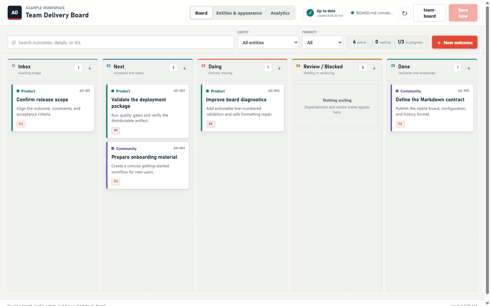

# LedgerBoard

Your Kanban board should survive the tool that displays it.

LedgerBoard is a local-first VS Code board whose source of truth is three readable Markdown files.
It adds a polished drag-and-drop workflow, named task assignees, generic entity palettes,
conflict-safe autosave, and append-only analytics without an account, database, server,
or proprietary export.



## Highlights

- Exact, line-numbered diagnostics for card separators, multiline descriptions, mixed line endings,
  missing entities, malformed checkboxes, and first source/serialized differences.
- Safe **Normalize BOARD.md Formatting** workflow in the Command Palette and load-error screen.
- Faster initialization and multi-root discovery with parallel direct file reads, bounded probes,
  active-board reuse, and visible progress.
- 34 automated model, CLI, performance, and Extension Host tests, plus browser smoke coverage.

## Why LedgerBoard

- **Markdown stays authoritative.** Review every change in Git and edit the files with any text editor.
- **Local-first by design.** No telemetry, cloud sync, login, or hosted service.
- **Useful beyond software teams.** Entities can represent projects, clients, products, teams, or workstreams.
- **History without a database.** Semantic create, move, update, and delete events append to a readable ledger.
- **Safe around human edits.** Saves stop when a Markdown buffer changed outside the board.
- **Fast at runtime.** The extension has no runtime package dependencies.

## Quick Start

1. Open a folder in VS Code.
2. Run **LedgerBoard: Initialize Board in Folder** from the Command Palette.
3. Add people and entities, assign outcomes, and drag cards between columns.
4. Commit the resulting Markdown diff when you are ready.

Initialization creates only missing files and never overwrites an existing one:

```text
BOARD.md
KANBAN-CONFIG.md
KANBAN-HISTORY.md
```

Run **LedgerBoard: Open Board** whenever you want to return. In a multi-root workspace, LedgerBoard
checks workspace roots first, validates candidates in parallel, and lets you choose when needed.

## Features

### Board

- Inbox, Next, Doing, Review / Blocked, and Done workflow
- Hard three-card Doing WIP limit
- P1-P4 priorities
- Search and entity, assignee, and priority filters
- Responsive desktop and narrow-editor layouts
- One-second autosave with visible pending, saving, saved, and blocked states

### People, entities, and appearance

Add people by name in the **People & entities** view, then optionally assign an outcome in its editor.
Assigned people appear on cards with compact avatars and can be used to filter the board. Assigning,
reassigning, and clearing an assignee writes the previous and new person IDs to the history ledger.

Every card has an `area` linked to a generic entity. An entity can be a project, account, product,
team, department, or any grouping that makes the board useful. Names and colors live in
`KANBAN-CONFIG.md`, alongside the people directory, board title, timezone, accent, and density.

### Analytics

- Current workload and completion rate
- Work by status, priority, and entity
- 7, 30, and 90-day activity ranges
- Recorded throughput and median cycle time
- Recent semantic activity from the append-only history ledger

Existing boards begin with honest baseline observations. LedgerBoard never invents old creation or
completion dates.

## Commands

| Command | Purpose |
|---|---|
| **LedgerBoard: Initialize Board in Folder** | Create the missing Markdown bundle files |
| **LedgerBoard: Open Board** | Discover and open a board in the workspace |
| **LedgerBoard: Add Outcome** | Open the board directly in the new-outcome dialog |
| **LedgerBoard: Validate Board Bundle** | Validate syntax, entities, WIP, history, and round-trip safety |
| **LedgerBoard: Normalize BOARD.md Formatting** | Safely fix card separators and mixed line endings |
| **LedgerBoard: Open Board Standard** | Open the complete format and agent-generation contract |

You can also right-click a folder in Explorer and choose **Initialize Board in Folder**.

## Markdown Contract

A card is deliberately small:

```markdown
- [ ] AO-001 — Prepare the architecture review · P2 · area:project-alpha
    - **Description:** Consolidate the decisions, risks, and recommended next steps.
    - **Assignee:** alex-smith
```

Status is the section containing the card. Description and Assignee are optional details. The full,
versioned contract is in [BOARD-STANDARDS.md](BOARD-STANDARDS.md), including a ready-to-paste prompt
for coding agents that generate compatible boards.

Adjacent cards require exactly one blank physical line:

```markdown
- [ ] AO-001 — First outcome · P1 · area:project-alpha
    - **Description:** First description.

- [ ] AO-002 — Second outcome · P2 · area:project-alpha
    - **Description:** Second description.
```

Descriptions remain one physical line. LedgerBoard reports exact card IDs and line numbers for
separator, multiline-description, mixed-line-ending, and first-difference errors.

## Troubleshooting

### Board does not open

Run **LedgerBoard: Validate Board Bundle**. The error identifies the first actionable issue. If the
issue is formatting-only, choose **Normalize formatting**. Semantic problems such as missing entities,
duplicate IDs, or multiline descriptions must be corrected in Markdown.

### Formatting normalization

**Normalize BOARD.md Formatting** previews the issues and asks for confirmation. It fixes only safe,
non-semantic formatting: missing/extra blank separator lines and mixed line endings. It does not add
history events or modify card content.

### Large or multi-root workspaces

LedgerBoard checks root bundles before recursive discovery, probes roots in parallel, reads candidate
files directly, and bounds slow filesystem probes. Common commands reuse the active board rather than
rescanning the workspace.

## Intentional limitations

LedgerBoard deliberately does not provide subtasks, due dates, estimates, multiline
descriptions, cloud synchronization, or a mobile client. Those constraints keep the Markdown contract
small, deterministic, reviewable in Git, and durable without the extension.

## Privacy and Trust

LedgerBoard does not collect telemetry and does not make network requests. It reads and writes only
the three Markdown files in the board folder selected through the workspace. Webview scripts use a
strict Content Security Policy, and every save is validated again in the extension host.

The extension supports untrusted and virtual workspaces because it never executes workspace content.
As always, review source-control changes before sharing a board that may contain private information.

## Requirements

- VS Code 1.103 or later
- A writable workspace for editing (read-only virtual workspaces can still be inspected)

There are no external runtime dependencies.

## Development

### Copilot canvas preview

The project extension in `.github/extensions/ledgerboard-preview` registers a **LedgerBoard preview**
canvas whenever this repository is opened in the Copilot app. It serves the current `media` assets
directly from the checked-out branch against isolated sample data, so UI changes can be tested without
modifying a real board. Use **Reload UI** after editing assets and **Reset data** to restore the fixture.

```powershell
npm ci
npm run privacy:scan
npm run test
npm run compile
npm run test:integration
npm run vsix
```

Press `F5` to launch an Extension Development Host. The project uses TypeScript, esbuild, the VS Code
test runner, and Node's built-in test runner.

Releases are published from validated source by project maintainers.

See [CONTRIBUTING.md](CONTRIBUTING.md), [SECURITY.md](SECURITY.md), and
[SUPPORT.md](SUPPORT.md) before opening a pull request or security report.

## License

[MIT](LICENSE)
